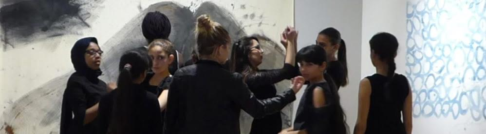

===

Danse au Musée est un projet chorégraphique imaginé par Elsa Decaudin, mené sur Perpignan et Nîmes.

Ce projet consiste en une intervention artistique autour de la danse au sein de Musée (d'art, d'histoire naturelle, de culture contemporaine, de culture populaire, etc.) à destination d'un groupe d'enfants ou d'adolescent rencontrant certaines difficultés. Ces interventions donnent lieu à une performance in situ suite à une série d'atelier de création. Ce projet permet de créer du lien entre le musée & l'oeuvre et des publics jeunes, dans un rapport et un statut qui soit celui d'acteur.

Il existe avec le partenariat du pôle museal et le service culturel de la ville de Perpignan et l'AFEV-66, et le soutien de la DRAC et le CEGET-66.

Il sera mené avec le partenariat du Musée du Vieux Nîmes et du rectorat du Gard, et le soutien de la DRAC et du CEGET-30 (en attente).

