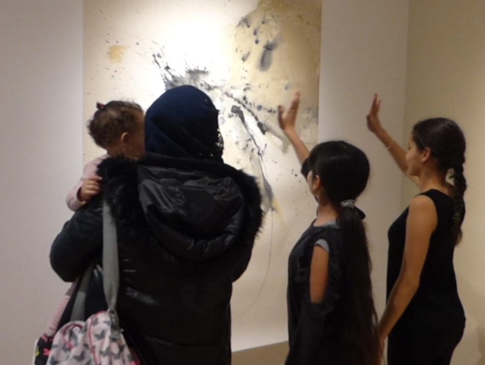
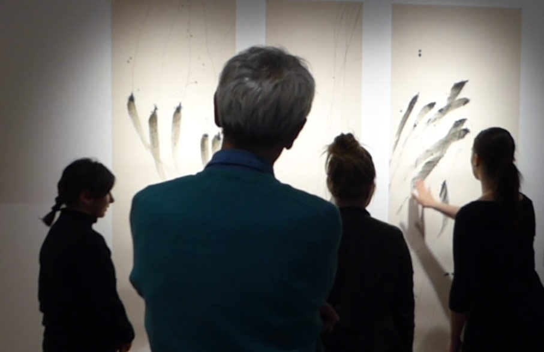

===

Sur Perpignan, le projet existe depuis 2014 avec l'aide de la DRAC, du CEGET-66 et de la mairie de Perpignan et en collaboration avec l'AFEV.

2014 : au Musée du Castillet  
Spectacle "Frontière" - idée et Chorégraphie : Elsa Decaudin

2015 : au centre d'Art Contemporain Walter Benjamin en lien avec l'exposition de Laurent Perbos  
Spectacle "Sur un air de jeu" - idée et Chorégraphie : Elsa Decaudin   
[Teaser](https://vimeo.com/151231166)

2016 : au Musée d'histoire naturelle  
Spectacle " A mains animés, des animaux révélés" - idée et Chorégraphie : Elsa Decaudin, assistante : Charlotte Ducrot , Composition musicale Originale : BANCAL   
[Teaser](https://vimeo.com/198332393)

2017 : au Musée d'art Hyacinthe Rigaud en lien avec l'exposition temporaire de Jean et Jacques Capdeville  
Spectacle "NUANCES" - idée et Chorégraphie : Elsa Decaudin, assistante : Christelle Larroque, Composition musicale Originale : BANCAL  
[Teaser](https://vimeo.com/280160890)

[owl-carousel items=1 nav= true loop=true margin=10]

[/owl-carousel]

Documentaire de suivi du projet par Sébastien Yves Lefebvre  en 2015/2016
[plugin:vimeo](https://vimeo.com/https://vimeo.com/151375980)
