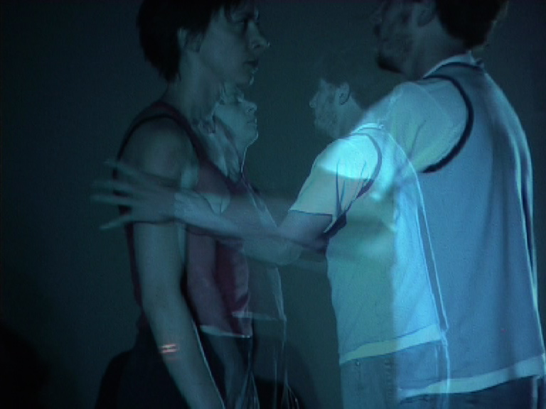
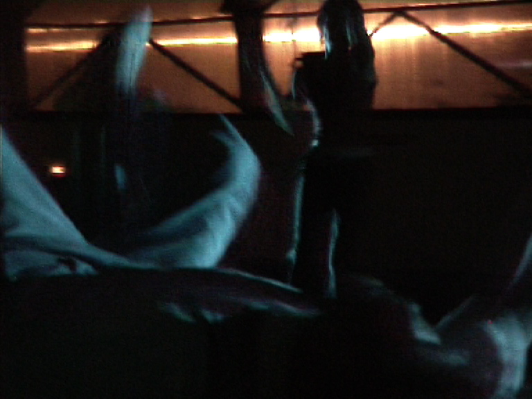
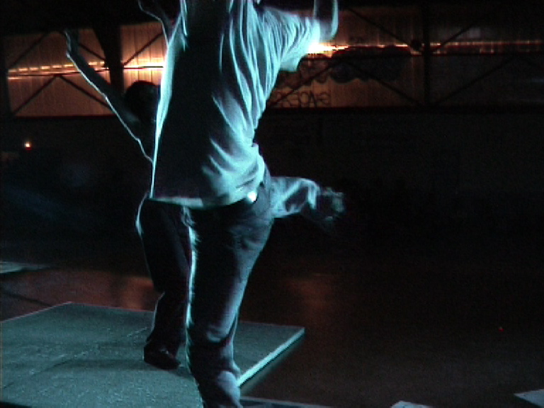

Marathon Photo, organisé par l'association les Photogènes - Montpellier, juin 2004.  

===

Idée & interprétation : Elsa Decaudin et Damien Manivel  
Son : Thibault Moste  
Vidéo pour la production d'une vidéo danse en plan séquence : Bastien Defives  
Lumières : Luc Souche

[owl-carousel items=1 margin=10 loop=true nav=true]

[/owl-carousel]

[plugin:vimeo](https://vimeo.com/280563341)