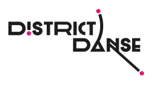

Une performance « évènementielle »   
pour 3 quartiers /   
3 groupes amateurs /   
3 chorégraphes   
et une ville.

===

Ouvert à tous, District Danse est un projet chorégraphique imaginé par Elsa Decaudin, mené en collaboration entre des acteurs locaux (associations de quartiers, maison pour Tous, partenaires culturels de la ville de Montpellier, …) et des équipes artistiques professionnelles.

Pensé sur 3 ans, ce projet de création artistique se fabrique durant 3 mois, avec 3 chorégraphes et 3 troupes d’habitants-amateurs-danseurs de 3 quartiers de Montpellier et se renouvelle chaque saison.

Ces créations ont des visées « professionnelles » dans leur exigences artistiques, mais l’objectif premier est de valoriser la notion d’expérience au sien de chaque groupe. Ainsi, les chorégraphes qui encadrent et accompagnent ce projet tentent d’allier la singularité de chacun à un travail chorégraphique commun sur le plateau.

### Pour le premier cycle 2015-2017 
Nous avons travaillé dans les quartiers Celleneuve, Lemasson/Mas Drevon et Pompignane en collaboration avec les Maison-pour-Tous de ces quartiers.
Les spectacles crées ont été présentés chaque année au studio Bagouet de ICI-CCN, puis en extérieur dans chaque quartier pour la reprise printanière.

L’équipe artistique a vu se mêler durant ces 3 ans : 
- les 3 chorégraphes Brigitte Négro, Leonardo Montecchia et Elsa Decaudin, 
- les danseurs-collaborateurs Lorenzo Dallaï, Viviane Mortean, Christelle Larroque, Marie-Adeline Choquet, et Floris Abras, 
les musiciens compositeurs Tony Bruneau, Jerome Hoffmann, François Ceccaldi et BANCAL,
- les créateurs lumières Sonya Perdigao et Nicolas Buisson.

Durant ces 3 ans, ce projet a été produit par PulX, coproduit par ICI-Centre chorégraphique national de Montpellier-Occitanie / Pyrénées mediterranée / direction Christian Rizzo avec le financement de la DRAC, la ville de Montpellier, la DDCS-34, la CAF et la Métropole Montpellier Méditerranée.  
Le CG34 a soutenu financièrement la saison 1.

[Résultats d’une enquête menée par les étudiants du Parcours Ingénierie des Projets et des Politiques Publiques (I3P) Encadrement Hélène Rey-Valette, Maître de Conférences, Responsable du Parcours](Enquete_Distric_Danse.pdf)

[owl-carousel items=3 margin=10 loop=true nav=true slideBy=3]

[/owl-carousel]

[Voir la presse](/presse/#district-danse)

### Pour un nouveau cycle 2019-2021

Production en cours
