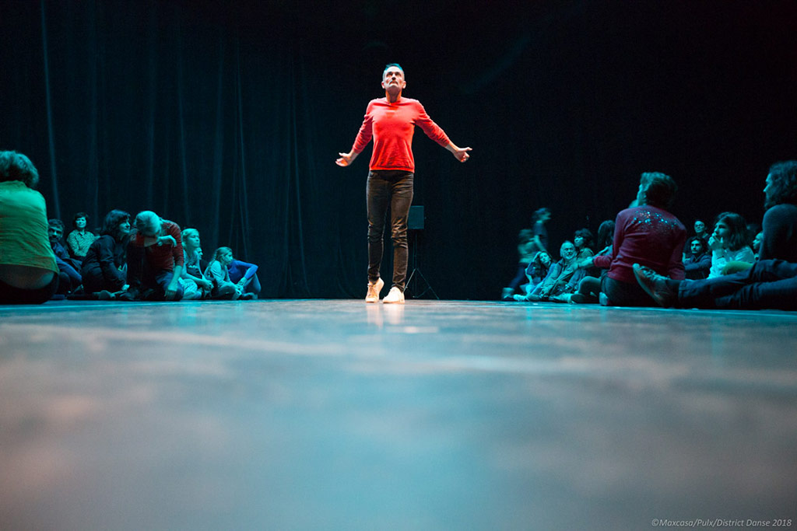
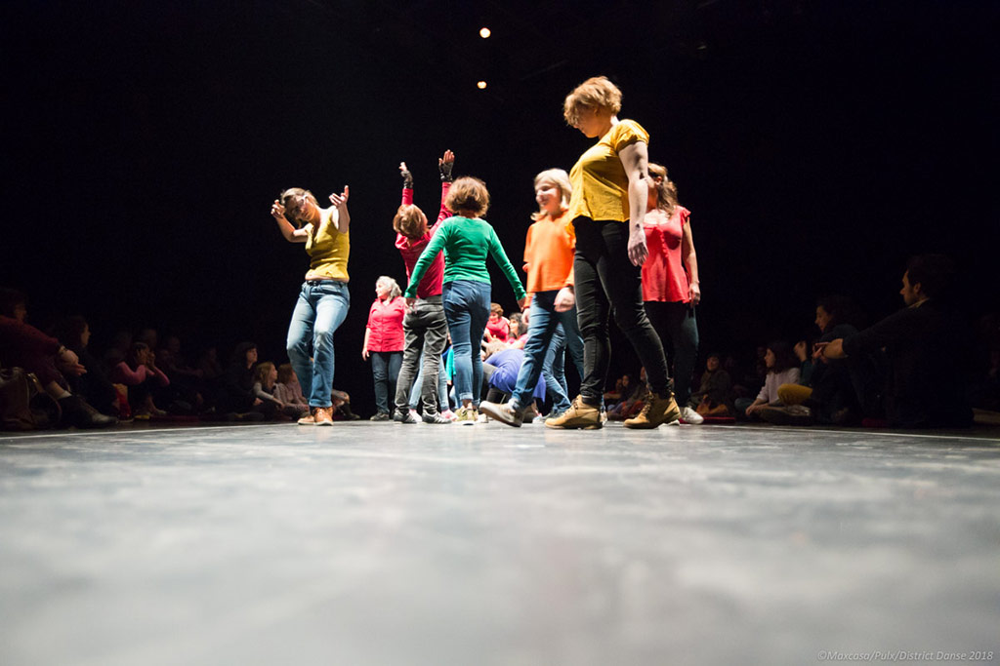
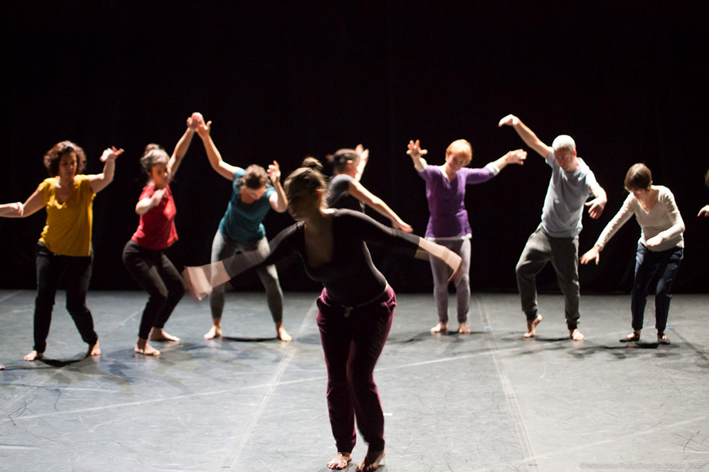
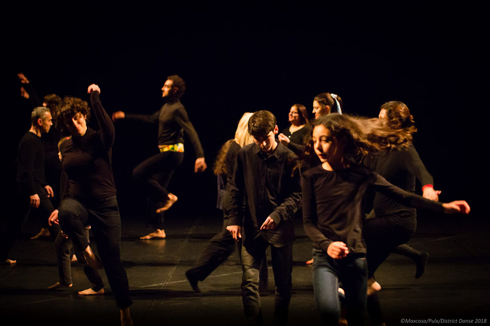
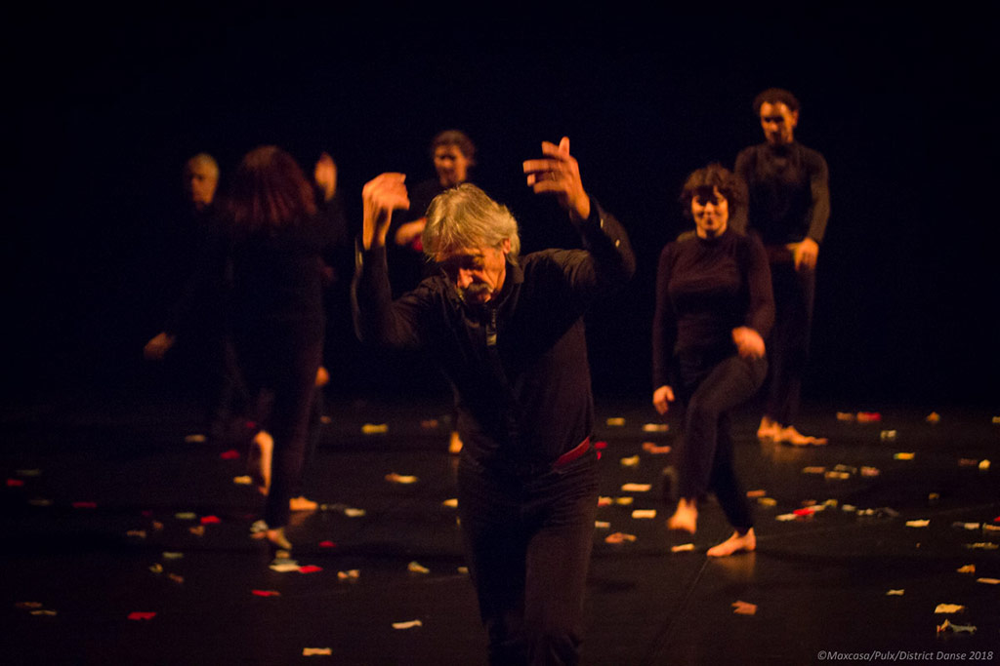
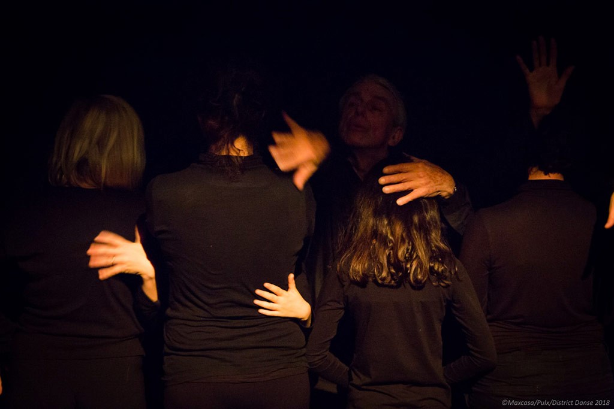
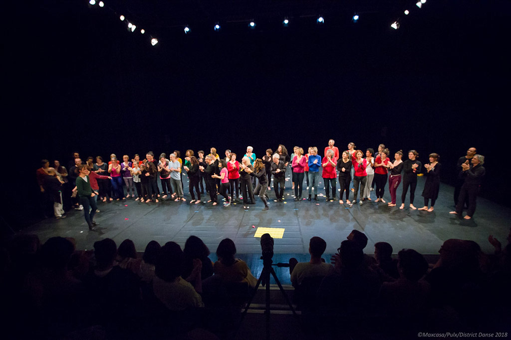

===

[owl-carousel items=1 nav=true loop=true margin=10]

[/owl-carousel]

Sens - quartier Lemasson / Mas Drevon - 08/01/2018
[plugin:vimeo](https://vimeo.com/https://vimeo.com/280425903)

Mon corps a disparu comme la flamme d’une bougie qu’on souffle - quartier Pompignane - 08/01/2018
[plugin:vimeo](https://vimeo.com/https://vimeo.com/280415476)

Sens - quartier Celleneuve - 08/01/2018
[plugin:vimeo](https://vimeo.com/https://vimeo.com/280403712)

[Voir la liste des participants [PDF]](FDS_District%20danse_janv_18.pdf)