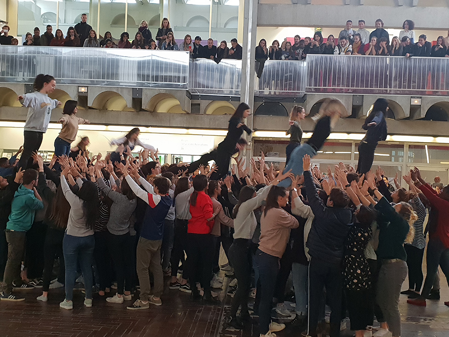

Flashmob avec 150 étudiants de première année de l'ENSAM - 29 octobre 2018 - Hall 1 de l'ENSAM

===

Suite à un workshop de 3 heures Danse et Architecture avec les 150 étudiants de premières années de l'Ecole Nationale Supèrieure d'Architecture de Montpellier, à l'Agora de la Danse, ce flashmob a été présenté dans le Hall 1 de l'école le 29 octobre 2018, dans le cadre du colloque Architecture Danse Design.

voir la vidéo de la répétition, en attendant celle de la performance
[plugin:vimeo](https://vimeo.com/300933589)
