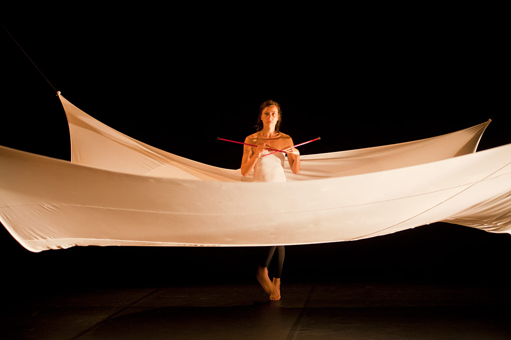
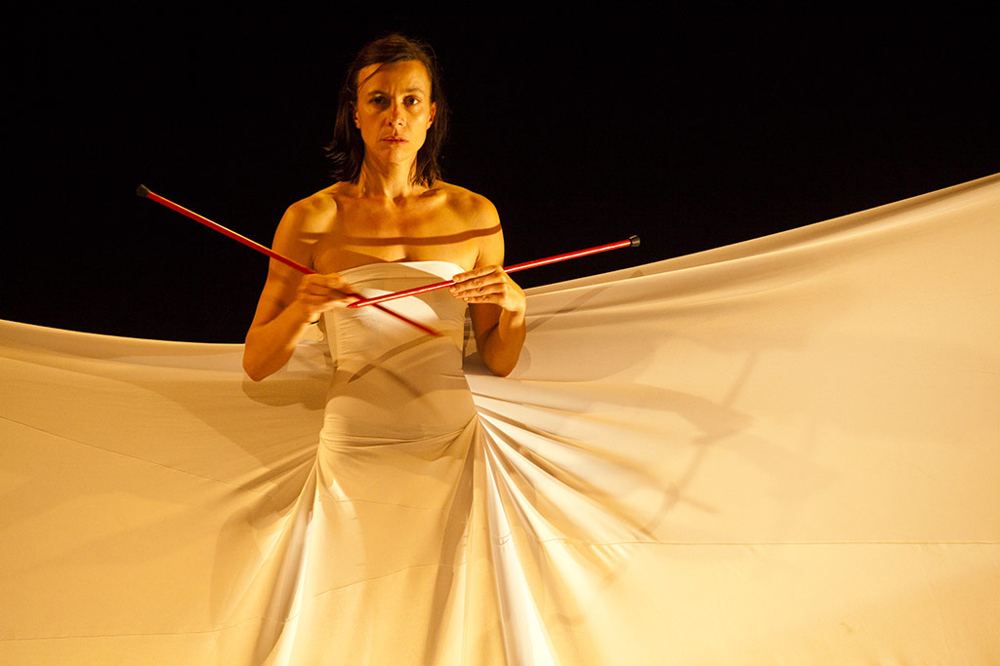
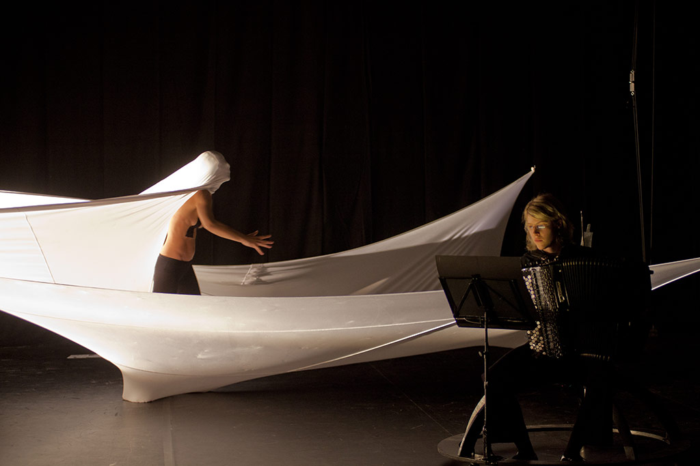
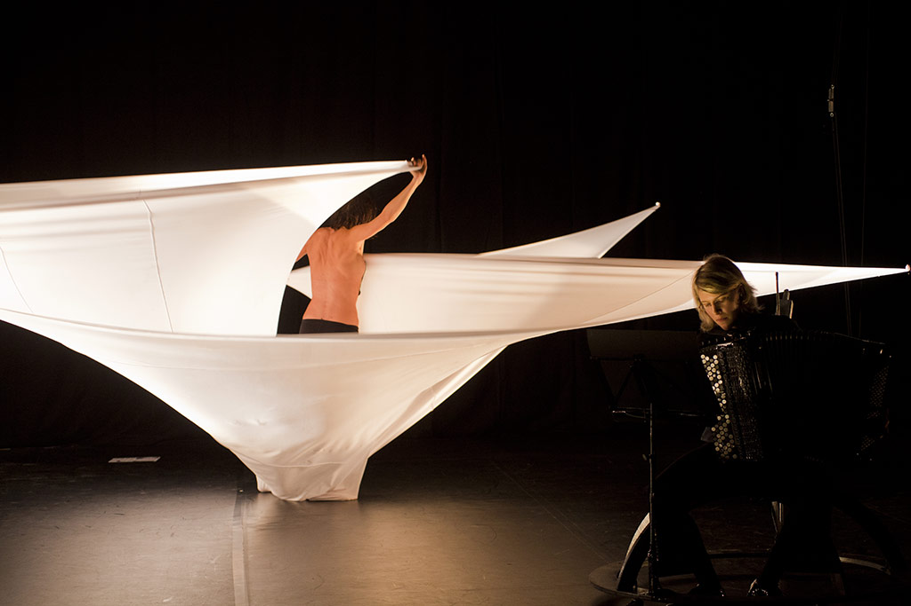
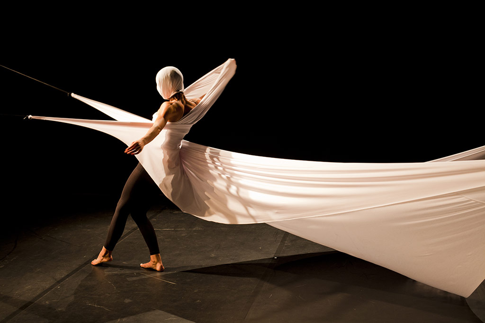
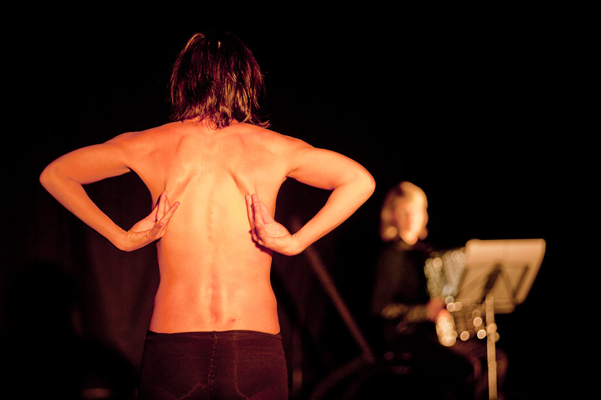
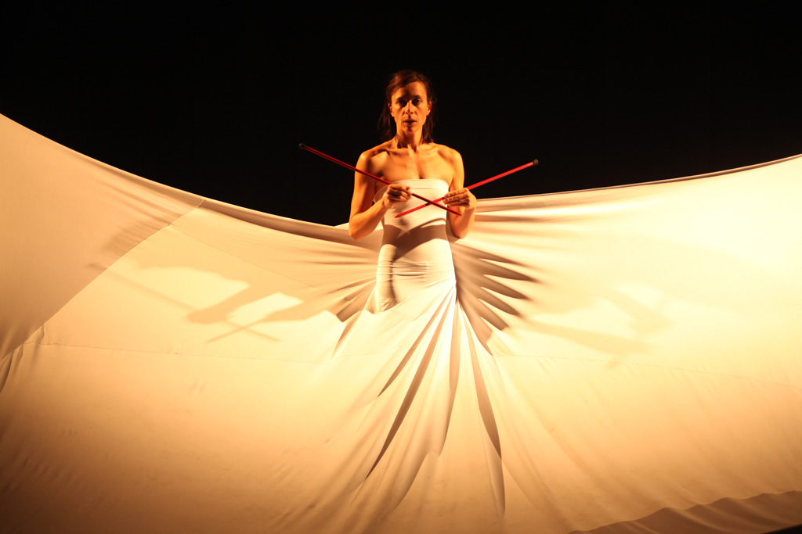
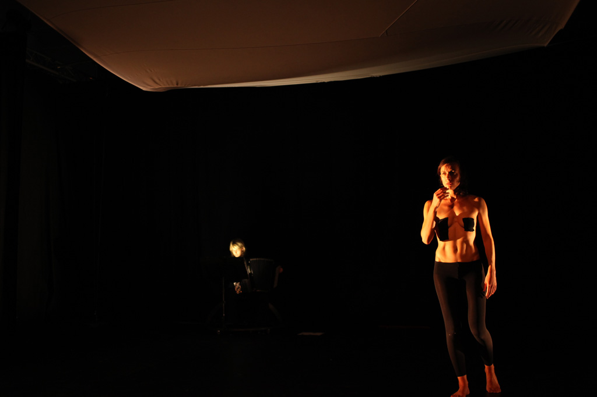
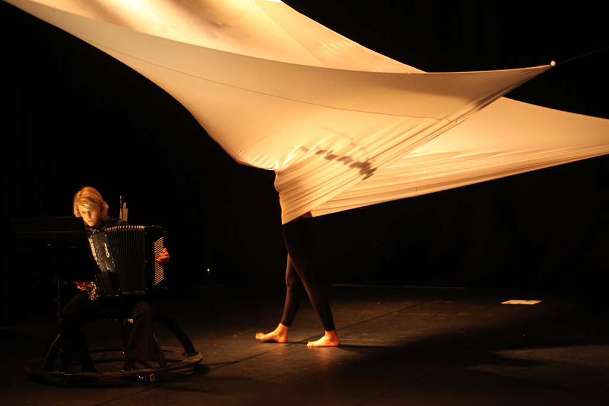

Nous interrogeons de manière poétique cette illusion de pouvoir se détacher du genre, d'être un corps de femme sans normes sociales.

===

### Distribution

Dramaturgie et mise en scène : Alice Carré  
Chorégraphie et interprète : Elsa Decaudin  
Accordéon : Elodie Soulard  
Lumières et direction technique : Jean-Philippe Lambert  
Scénographie : Lucie Lelong

 
À l'origine de ce spectacle, se trouve un questionnement, celui d'artistes issus d'une même génération, arrivée après les grands mouvements féministes, ayant grandi dans l'illusion d'une parfaite égalité entre les sexes. Si cette question du genre nous a paru pendant longtemps secondaire, elle nous est revenue comme un boomerang au moment des choix professionnels et n'a cessé dès lors de refaire surface. À travers une figure tendue entre deux extrêmes, Pénélope Matador, nous interrogeons de manière poétique cette illusion de pouvoir se détacher du genre, d'être un corps de femme sans normes sociales.
 
La chorégraphie d'Elsa Decaudin cherche à réintroduire de l'étrangeté dans cette curieuse féminité prétendument naturelle, à la mettre à distance du corps. L'accordéon, interprété sur scène par Elodie Soulard fait écho à ces tiraillements et paradoxes qui parcourent le corps à travers un répertoire allant du classique au contemporain. Les deux artistes dialoguent avec une scénographie évolutive et mouvante : univers poétique et métaphorique, seconde peau ou machinerie implacable avec laquelle les interprètes entrent parfois en conflit, parfois en osmose.

[owl-carousel items=1 margin=10 loop=true autoplay=true autoplayHoverPause=true nav=true]

[/owl-carousel]

[plugin:vimeo](https://vimeo.com/https://vimeo.com/248100725)
 
### Soutiens

Production : Association Pulx.  
Avec le soutien de : TMT (48), le Théâtre Kantor de l'ENS de Lyon, Contre-Champ (12) et la mission départementale de l'Aveyron.  
Remerciements au CCN de Montpellier et au Théâtre du Saulcy (Metz).  
Avec l'aide au projet de la DRAC-LR et de la Région Languedoc-Roussillon.  
Pulx reçoit une aide de la mairie de Montpellier.  
Avec une aide à la création en 2011 de la région Languedoc Roussillon.  
Pièce joué au Klap à Marseille en novembre 2012 pour "question de danse".

### Remerciements

Le CCN-Montpellier pour un prêt de studio lors de trois temps de travail en décembre 2010, avril et septembre 2011.  
Le théâtre du Saulcy à Metz pour un accueil plateau d’un temps de travail en juillet 2010.  
Un remerciement tout particulier à la famille REYNIER et surtout à leur fils François.

[Fichier de présentation](PulX-Penelope_Matador-juin12.pdf)  
[Fiche technique](technique-penelope-matador-pulx.zip)