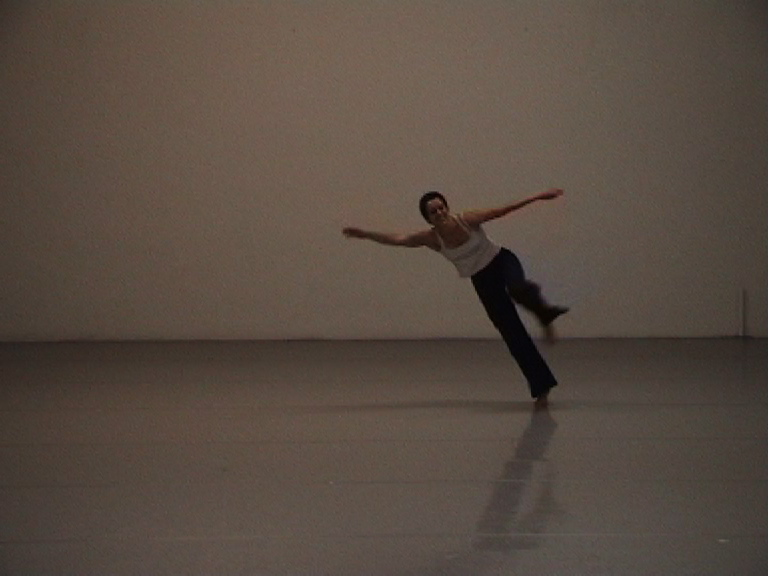
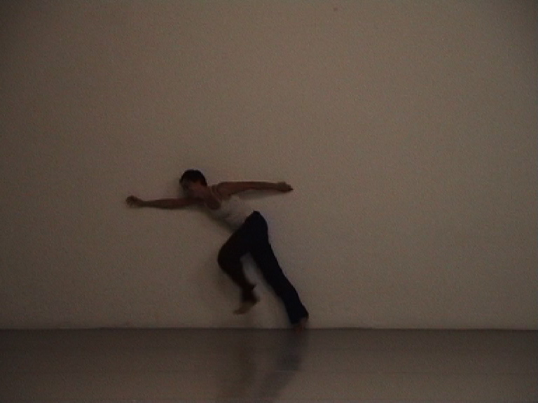
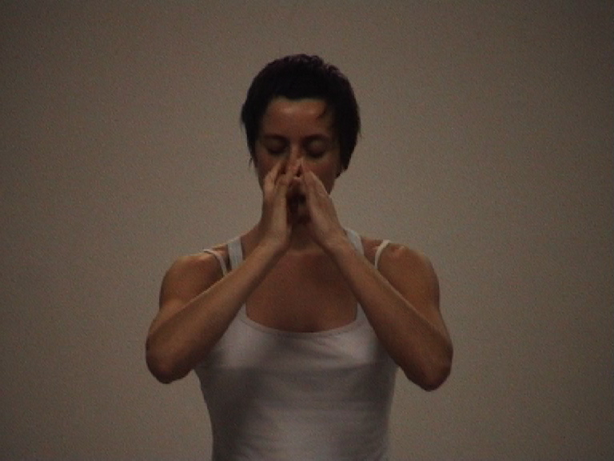
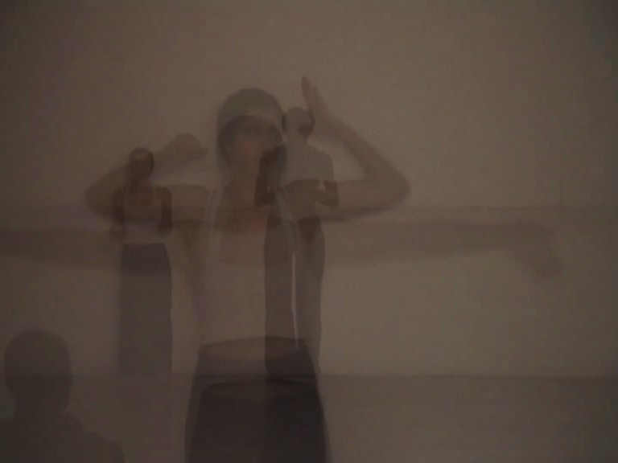

Tanztendenz, alternatif'event - Munich, août 2004  

===

Idée et performance : Elsa Decaudin, avec le regard de Simone Erbeck

Structure en trois jours sur un parallèle entre le kung-fu et la rigidité du protocole de salutation bavarois. 

[owl-carousel items=1 margin=10 loop=true nav=true]

[/owl-carousel]

[plugin:vimeo](https://vimeo.com/281877910)