Syntonie propose un univers sensible, poétique et burlesque et est fabriquée en direct et à vue.

===

### Distribution

Mouvement : Elsa Decaudin  
Photographie : Bastien Defives  
Musique : Jean-Philippe Lambert  
Création Lumières : Luc Souche  

Avec cette pièce, PulX fait se rencontrer au même moment et dans le même espace trois langages, celui de la danse, de la photographie et du son pour créer une oeuvre originale et atypique.

Composée d'un ensemble de six tableaux, Syntonie propose un univers singulier, sensible, poétique, drôle, voir burlesque. La structure dramaturgique est construite mais subsiste toujours une part d'improvisation. Cette pièce dite « en temps réel » est fabriquée en direct et à vue.

Loin d'être un prétexte ou une simple superposition d'images associées à la danse, la photographie fait partie intégrante du spectacle. Les photos numériques sont prises en direct et projetées quasi simultanément. De même, les différents objets sonores constituant la musique, bien que définis dans les grandes lignes, sont produits et diffusés durant le spectacle. Pour chaque scénette, les chorégraphies de la danseuse sont plus ou moins écrites et sont interprétées aussi selon différents paramètres.  
Afin que l'ensemble fonctionne, l'écoute et le dialogue entre chacun des protagonistes sont primordiaux. L'intitulé de la pièce éclaire la démarche artistique : les interprétations dansées, photographiques et sonores tentent d'être en accord, soit en syntonie.

Avec cette création, PulX souhaite réellement impliquer le public Pour éviter la dimension purement frontale, le public se trouve au coeur du dispositif scénique, sur le plateau avec les interprètes.  
En créant un rapport de confiance, voire de connivence, les interprètes invitent le spectateur qui le souhaite à être acteur, à se déplacer sur le plateau, à choisir son point de vue et éventuellement à participer.

[owl-carousel items=1 margin=10 loop=true nav=true]
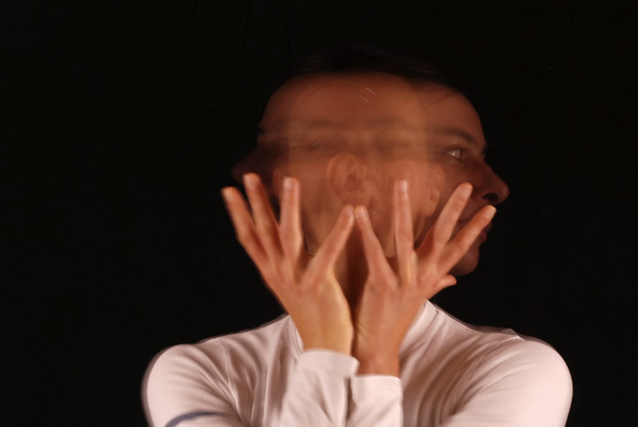
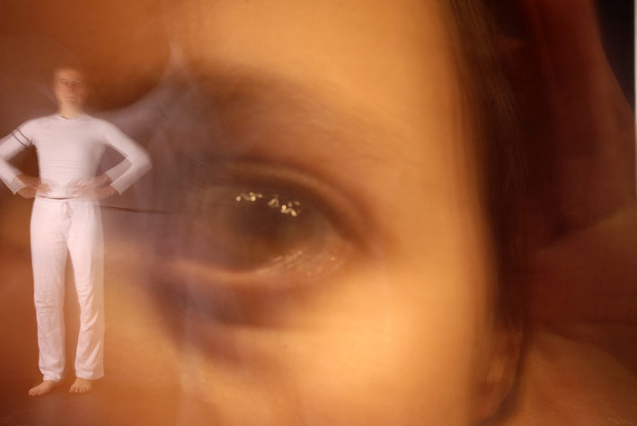
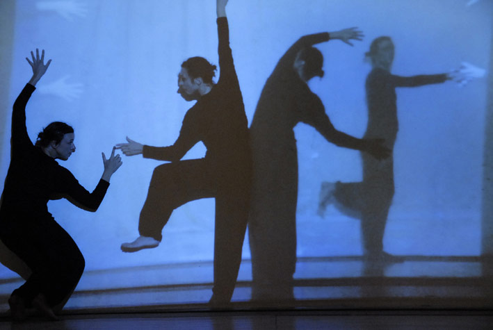
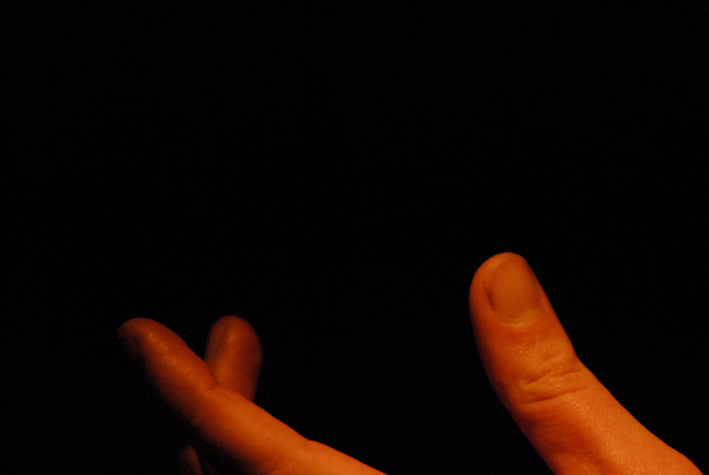
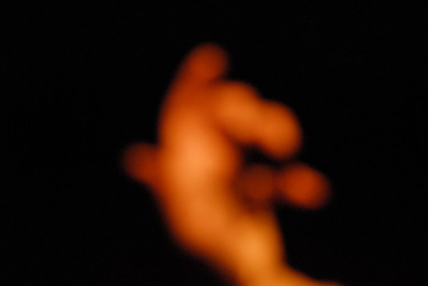
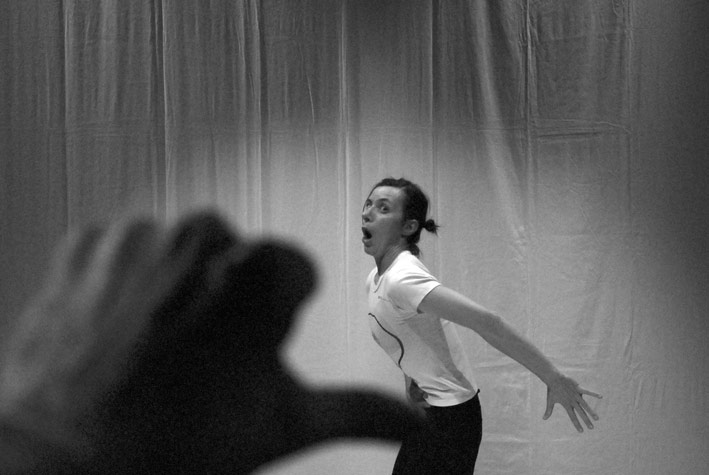
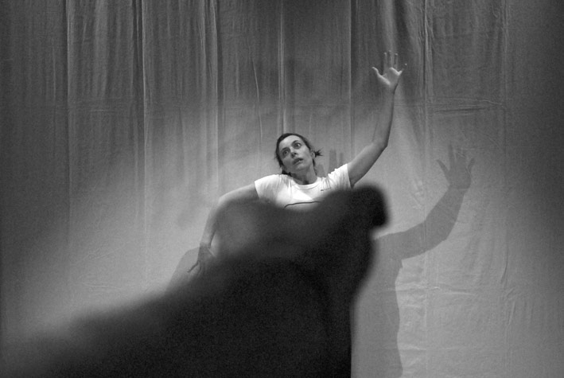
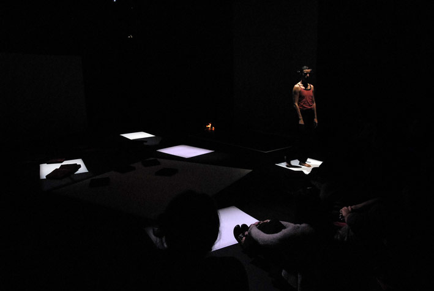
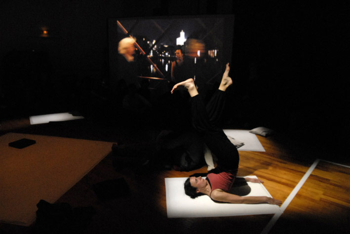

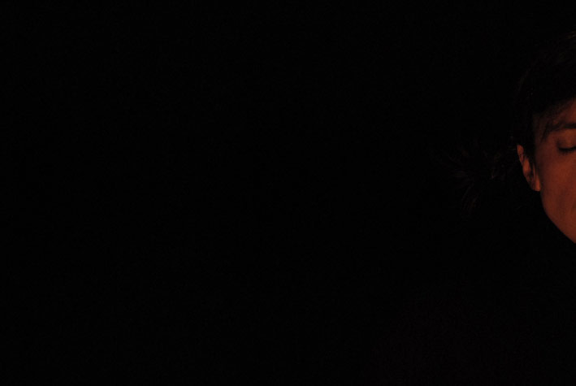
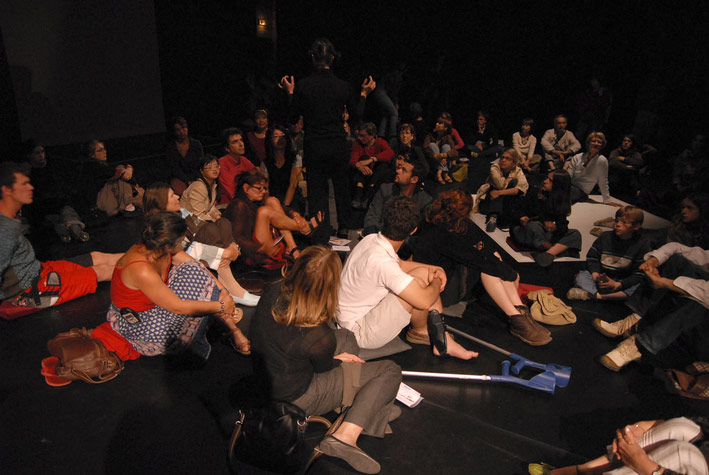
[/owl-carousel]
 
### Production, soutiens et partenariats

Production : PulX  
Avec l'aide de la DRAC Languedoc-Roussillon, la Région Languedoc-Roussillon, l'ADDM 34, la Ville de Montpellier et Réseau en Scène Languedoc-Roussillon.  
Avec le soutien de Kawenga (Montpellier), la Tannerie (Barjols) et l'association Contrechamp (Arvieu). Remerciements au CCN-MLR de Montpellier.  
Syntonie a été labellisé par Cultures France dans le cadre de l'événement «  França.Br 2009 » l'année de la France au Brésil (21 avril-15 novembre 2009).

[Fiches techniques](Fiches_techniques_Syntonie.pdf)  
[Fiche de présentation](Fr_Syntonie_PulX_12.pdf)  
[Revue de presse](Revue_de_presse_Syntonie.pdf)
