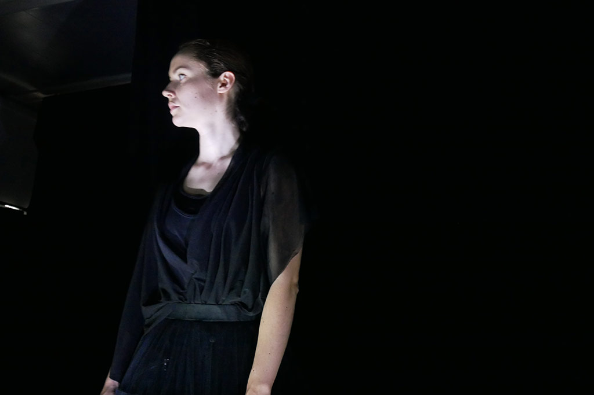
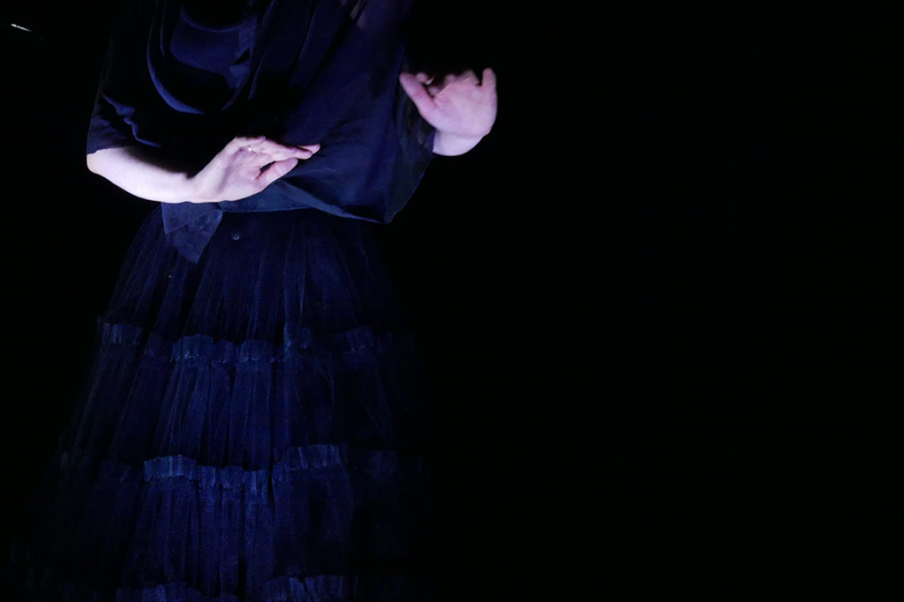

"Impetueuse m." est le portrait d'une femme. Une femme avec ses envies, ses tourments, ses aspirations, sa solitude, ses batailles, son danger. Comment échapper à sa propre gravité.

===

[Performance](#performance) | [court métrage](#court)

"Impetueuse m." est le portrait d'une femme. Une femme avec ses envies, ses tourments, ses aspirations, sa solitude, ses batailles, son danger. Comment échapper à sa propre gravité. 

### Performance {#performance}

Cette performance est en cycle de diffusion.  
Si vous souhaitez la diffuser, [contactez nous](/contact).

[owl-carousel items=1 nav=true loop=true margin=10]

[/owl-carousel]

Palazzo Corsini - 11 janvier 2018 - Roma
[plugin:vimeo](https://vimeo.com/https://vimeo.com/258638486)

### Court métrage {#court}

Nous adaptons cinématographiquement la performance "impétueuse m." présentée en mai dernier à l'ENSAM.

Nous tournons à la fin de l'été en Islande. Nous nous attaquons directement à la post-production dés qu'on rentre pour pouvoir présenter cette oeuvre collective au printemps 2019.  
[Cliquez ici pour tout savoir et nous accompagner](https://www.leetchi.com/c/impetueuse-m)