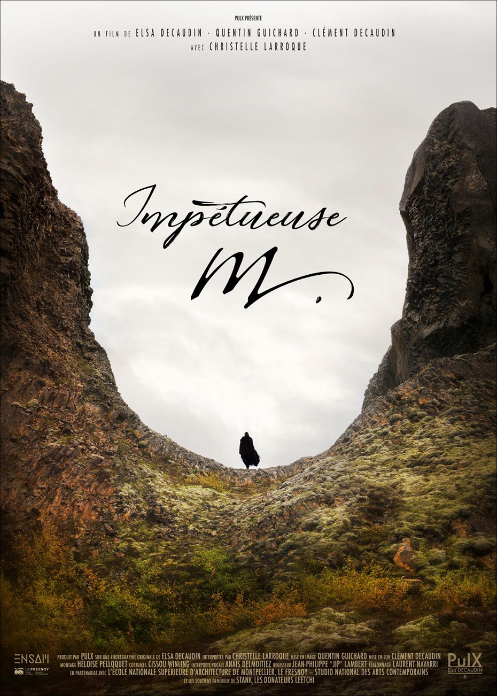

"Impetueuse m." est le portrait d'une femme. Une femme avec ses envies, ses tourments, ses aspirations, sa solitude, ses batailles, son danger. Comment échapper à sa propre gravité.

===

[Performance](#performance) | [court métrage](#court)

"Impetueuse m." est le portrait d'une femme. Une femme avec ses envies, ses tourments, ses aspirations, sa solitude, ses batailles, son danger. Comment échapper à sa propre gravité. 

### Performance {#performance}

Cette performance est en cycle de diffusion.  
Si vous souhaitez la diffuser, [contactez nous](/contact).

[owl-carousel items=1 nav=true loop=true margin=10]

[/owl-carousel]

Palazzo Corsini - 11 janvier 2018 - Roma
[plugin:vimeo](https://vimeo.com/https://vimeo.com/258638486)

### Court métrage {#court}

Le court-métrage impétueuse m. est en pleine construction !
Il sera terminé le 15 janvier 2019 prochain. Nous travaillons à sa diffusion en festivals. Une projection en salle est prévu dés le printemps qui arrive.

Ce film est produit par PulX en partenariat et coproduction avec l'Ecole Nationale Supérieure d'Architecture de Montpellier et le Fresnoy - Studio National des arts contemporains et avec de joyeux et enthousiastes donateurs.

voir dossier de présentation [3_DOSSIER_IMPETUEUSE_M_PULX_C.DECAUDIN_070918.pdf](3_DOSSIER_IMPETUEUSE_M_PULX_C.DECAUDIN_070918.pdf)

Affiche et Photo de Quentin Guichard