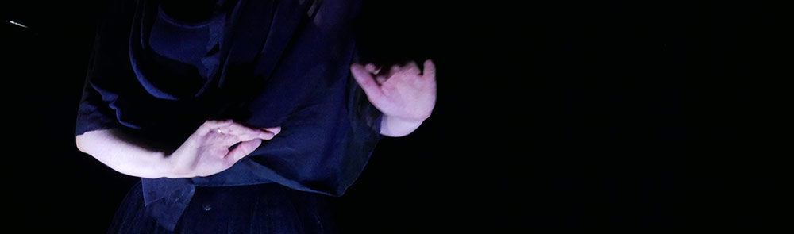

"TRYPTIK - titre provisoire" : est un projet de création multiple, telle une carte postale qui voyage et se transmet, telle une histoire qui se raconte et se partage.

===

"TRYPTIK - titre provisoire" : est un projet de création multiple, telle une carte postale qui voyage et se transmet, telle une histoire qui se raconte et se partage.  
1 spectacle de 1 heures pour plateau. (en cours de production)  
3 performances de 20 minutes indépendantes les une des autres présentables en galerie, musée, appartement...  
(2 performances sont déjà en cycle de diffusion.)  
3 court-métrage associés à chaque performance, projetable en festival, cinéma ou galerie.(en cours de production)

Distribution : Idée et mise en scène : Elsa Decaudin / Musique : Bancal / Interprètes : Christelle Larroque et Leonardo Montecchia / Lumière : Jean-Philippe Lambert.

"A la recherche d’un espace mental qui reflétera nos vertiges face à nos vestiges, qui fera scintiller nos terribles soustractions aux échafaudages de pensées que nous nous plaisons à élever, qui réfléchira la fougueuse colère et l’interminable interrogation que nous ne sommes qu’en exil et en solitude."

Ce projet est issu d'une rencontre, avec Federica Dal Falco, artiste Italienne et avec son projet de lightbox composé de 3 boites américaines exposant des oeuvres photographiques retravaillées et filtrées :«Abito Museale », « Dancing » et  « Fuga in Bisanzio in frammenti ».

Ces 3 oeuvres sont elles-mêmes venues de cartes postales trouvées sur un marché aux puces, ou sur un marché ou dans un musée.

Une carte postale a pour vocation de voyager et de raconter des histoires, des souvenirs. Elle s’inscrit dans plusieurs temporalités : quand on l’écrit, quand on la lit, quand on la range, quand on la retrouve, quand on la partage et la montre.

Ce projet raconte 3 histoires, il est 3 portraits.

"Impetueuse m." est le portrait d'une femme. Une femme avec ses envies, ses tourments, ses aspirations, sa solitude, ses batailles, son danger. Comment échapper à sa propre gravité.
Cette performance est en cycle de diffusion.

"Around dancing" est le portrait croisé de 2 personnes qui se nourrissent l'une l'autre pour se présenter, dans une généalogie qui s'inspire et s'invente, dans un engrenage dynamique d'apparition et d'évaporation.  
Cette performance est en cours de création

"je l'appelais toujours monsieur." est le portrait d'un homme en exil, un homme d'écriture, d'un homme navigant dans les différentes strates de ses réalités, très clairement inspiré du poète Joseph Brodsky.
Cette performance est en cycle de diffusion.

