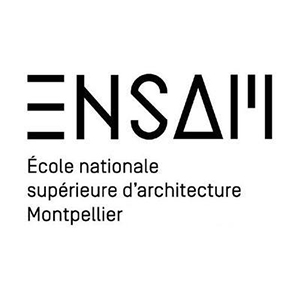
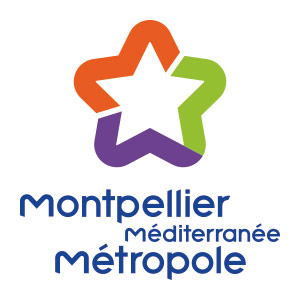
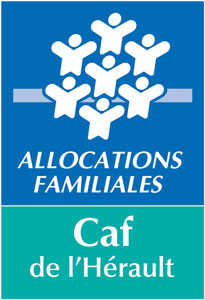
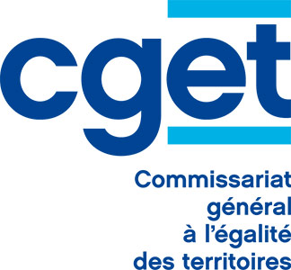

  
L’ENSAM, coproducteur, aide et soutien dans le cadre de la résidence d'artiste Pulx/Elsa Decaudin de janvier 2016 à décembre 2019.

  
DRAC

   
Mairie de Montpellier

  
Montpellier Méditerranée Métropole 

  
CAF-34 

   
CEGET_34

  
CEGET-66

  
ICI-Centre chorégraphique national de Montpellier, coproducteur du projet District Danse, cycle 1
