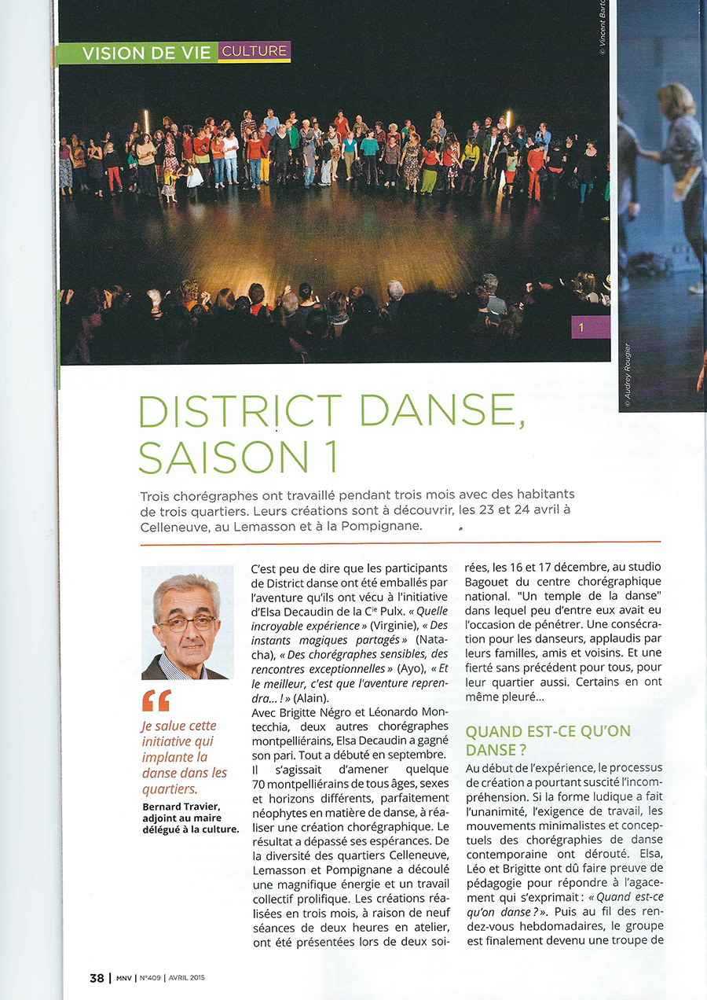

[District Danse](#district-danse) | [Tryptik](#tryptik) 

## District Danse {#district-danse}

Ci-dessous les reportages vidéos et audio :

[District Danse saison 2 : 3 troupes de danseurs de 3 quartiers de Montpellier présentent 3 chorégraphies - France 3 Occitanie](https://france3-regions.francetvinfo.fr/occitanie/emissions/9h50-occitanie/3-troupes-danseurs-3-quartiers-montpellier-presentent-leur-choregraphie-commune-district-danse-saison-2-1202273.html)

[District Danse saison 3 : la danse pour renforcer le lien social entre les habitants - France 3 Occitanie](https://france3-regions.francetvinfo.fr/occitanie/herault/montpellier/montpellier-danse-renforcer-lien-social-entre-habitants-1388169.html)

[Scén'Orama, l'actualité des arts vivants - Radio FM Plus](http://www.radiofmplus.org/scenorama-dannick-delefosse-danse-district-barbote-vinyl-market/)

## Tryptik {#tryptik}

